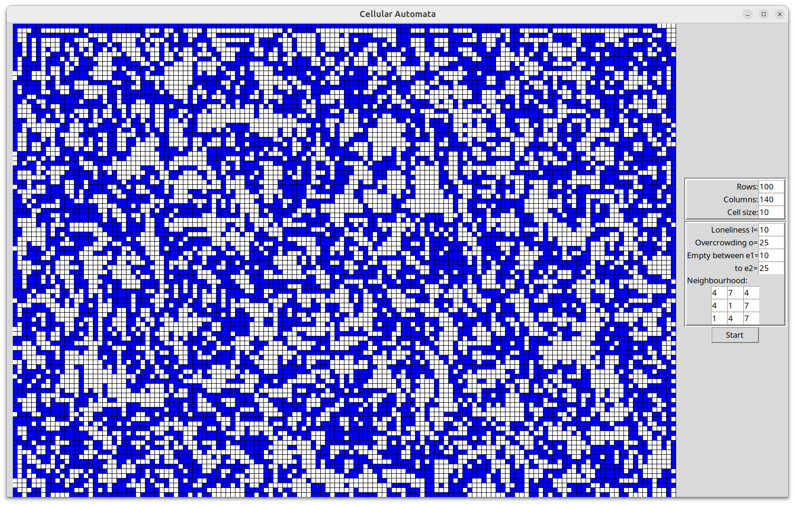
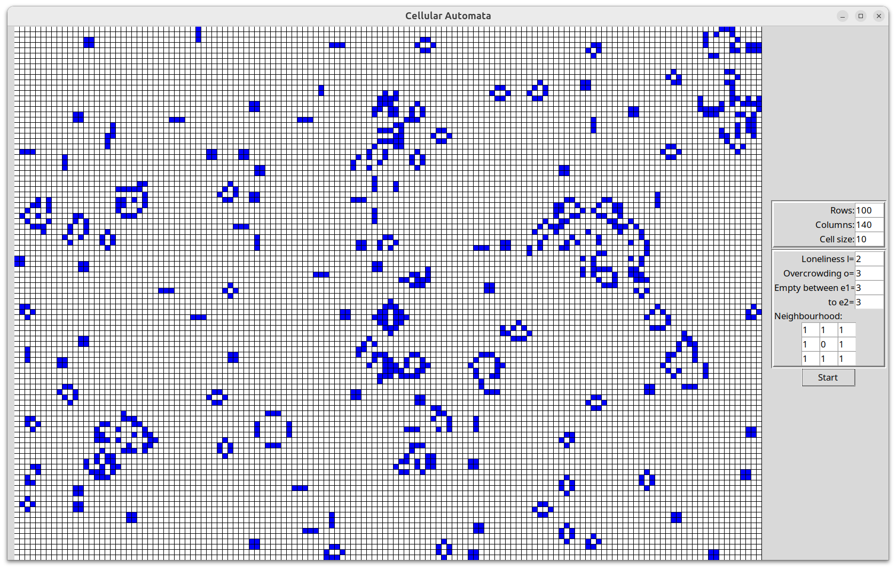

# Read Life

## Introduction

In the [Finite Group](https://www.patreon.com/FiniteGroup), we were playing with cellular automata. John Read suggested a version where the cell and its Moore neighbourhood are given a weight, with appropriate birth and death rules.

![The Rules of Read Life – general. Rules: 1. Any coloured cell with fewer than l is emptied (loneliness); 2. Any coloured cell with more than o is emptied (overcrowding); 3. Any coloured cell with r_1 –r_2 remains; [currently in the code this is ‘else’, so that r_1 = l and r_2 = o, but this can be changed] 4. Any empty cell with e_1–e_2 is coloured. The cell weights going left to right, top to bottom go A, B, C, D, E, F, G, H, I.](rules.png)

## Code provided

The code `readlife.py` runs the Read Life cellular automata, with some controls to set the rules. Initially:

- the values are set to l=10, o=25, e1=10 and e2=25. These numbers should be based on a sum of the weights, so since the weights are 1-9, these should be 9-81.
- the neighbourhood weights (A-I) are generated randomly. These should be numbers between 1-9. 
- the cell size is 10 and the grid size is 100x140. If you increase the grid size, you should decrease the cell size, and vice versa. 

The grid is filled with a random pattern of cells and the rules applied, starting when you press 'Start'.

The program will likely crash if the input is not as expected. 

There are approximately a million ways this program could be better. It is provided here for people to play around with the effect of changing the rules on the patterns generated. 

You can make the program iterate quicker or slower by changing the value of `sleeptime` in the code.

## Standard Game of Life

You can set this up to run the standard Game of Life ruleset by entering `1` for the neighbour cells, `0` for the cell itself, and using the standard Game of Life values l=2, o=3 and e1=e2=3.

